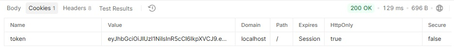

# TAREA5 - BACKEND2

API REST modular desarrollada con Node.js y Express, estructurada bajo una arquitectura por capas (**Router, Controller, Service, Repository**) con manejo global de errores y validación estricta de datos.

El sistema implementa un esquema de autenticación sin estado (*stateless*) mediante **JSON Web Tokens (JWT)** almacenados en cookies seguras (`httpOnly`), integrando **Passport.js** y **Zod** para la gestión de identidad y esquemas de entrada.

---

## Descripcion genera

* **Router:** Intercepta la petición HTTP, ejecuta middleware de validación sintáctica (Zod) y aplica middlewares de autenticación (Passport).
* **Controller:** Maneja el ciclo de respuesta HTTP, gestiona el envío/destrucción de cookies de sesión y formatea la salida JSON.
* **Service:** Contiene la lógica de negocio pura (validación de registros duplicados, hash de contraseñas con `bcrypt` y firma de tokens JWT).
* **Repository (DAO):** Capa de abstracción para la interacción directa con la base de datos (MongoDB / Mongoose).
* **Passport Strategies:** Encapsula la lógica de autenticación local e inspección de JWT.

---

## Configuración de autenticación y seguridad

1. **Zod Validation:** Valida la estructura y tipos de datos en `req.body` antes de llegar a la lógica de autenticación.
2. **Passport Local Strategy (`register` & `login`):** Intercepta las credenciales, delegando al `UserService` la verificación de hashes bcrypt y la creación del usuario.
3. **Passport JWT Strategy (`jwt`):** Extrae de forma segura la cookie enviada por el navegador mediante un `cookieExtractor` personalizado, verifica la firma del token y carga el payload en `req.user`.
4. **Cookie Strategy (`httpOnly`):** Previene ataques XSS impidiendo el acceso a la cookie desde el contexto de cliente de JavaScript.

---

## Endpoints para session, current y users


**Rutas Disponibles (Endpoints)**

| Método | Endpoint | Descripción |
| :--- | :--- | :--- |
| POST | /api/sessions/register | Endpoint base para crear un usuario. |
| POST | /api/sessions/login | Endpoint base para inicio de sesión. |
| GET | /api/current | Es una ruta protegida, se debe iniciar sesión previamente para usar esta ruta. |
| POST | /api/sessions/logout | Endpoint base para cierre de sesión |
| GET | /api/users | Obtiene la lista de usuarios registados. Solo tiene aurorizacion admin |


---


### 1. Registrar nuevo usuario
Registra un nuevo usuario en la base de datos previa verificación del esquema e inexistencia del email.

* **URL:** `/api/sessions/register`
* **Method:** `POST`
* **Middlewares:** `validateBody(registerSchema)`, `passportCall('register')`
* **Request Body:**
  ````json
  {
    "first_name": "Jhone",
    "last_name": "gaviria",
    "email": "jhone@email.com",
    "password": "123456"
  }
  ````
Success Response (201 Created):


````json
{
  "status": "success",
  "message": "Usuario registrado correctamente",
  "payload": {
    "email": "jhone@email.com",
        "role": "user"
  }
}
````

## Pruebas de Error:

400 Bad Request: Se envía un JSON sin un campo requerido (ej. sin email o password muy corta para probar la validación de Zod con registerSchema).
````json
{
    "status": "error",
    "message": "Error de validación en la petición",
    "errors": [
        {
            "field": "email",
            "message": "Invalid input: expected string, received undefined"
        }
    ]
}
````

409 Conflict: Se vuelve a enviar exactamente el mismo correo ya creado previamente. 
````json
{
    "status": "error",
    "message": "Ya existe un usuario registrado con ese email"
}
````


### 2. Inicio de sesion

Verifica las credenciales del usuario, genera un token JWT firmado y establece la cookie token en la respuesta HTTP.

* **URL:**  /api/sessions/login

* **Method:** POST

* **Middlewares:** validateBody(loginSchema), passportCall('login')

### Request Body:
````json
{
  "email": "jhone@email.com",
  "password": "123456"
}
````

Success Response (200 OK)
````json
{
    "status": "success",
    "message": "Inicio de sesión exitoso",
    "payload": {
        "id": "6ab1e162d9e22862abd8adfd",
        "email": "jhone@email.com",
        "role": "user"
    }
}
````


## Pruebas de Error (401 Unauthorized):

Intento ingresar con un correo que no existe.
Intento ingresar con una contraseña incorrecta.
Ambos deben devolver: "Credenciales invalidas".
````json
{
    "status": "error",
    "message": "Credenciales invalidas"
}
````

### 3. Obtener la sesion del usuario actual (Ruta Protegida)
Obtiene la información del usuario autenticado leyendo la cookie de sesión activa.

* **URL:** /api/sessions/current

* **Method:** GET

* **Middlewares:** passportCall('jwt')

* **Headers:** Cookie automática agregada por el navegador o Postman (token=...).

Success Response (200 OK)
````json
{
   "status": "success",
    "payload": {
        "id": "6ab1e162d9e22862abd8adfd",
        "email": "jhone@email.com",
        "role": "user"
    }
}
````

## Error Response (401 Unauthorized)

````json
{
    "status": "error",
    "message": "No autorizado"
}
````


### 4. Logout User

Invalida la sesión del cliente destruyendo la cookie almacenada en el navegador.

* **URL:** /api/sessions/logout

* **Method:** POST

Success Response (200 OK)
````JSON
{
  "status": "success",
  "message": "Sesión cerrada correctamente"
}
````

### 4. Obtener Lista de Usuarios (/users)

* **URL:** /api/sessions/users
* **Middlewares:** passportCall('jwt'), authorization(['admin'])
* **Method:** GET
* **Autenticación:** Requiere JWT con rol exclusivo admin.
* **Prueba con Rol admin (200 OK):**
Retorna el array con la lista de usuarios (filtrando el campo password):
````json
[
  {
    "id": "65f123456789...",
    "first_name": "Juan",
    "last_name": "Pérez",
    "email": "juan.perez@example.com",
    "role": "user"
  }
]
````

## Pruebas de Error:

401 Unauthorized: Si realizas la petición sin token.
{
    "status": "error",
    "message": "No autorizado"
} 

403 Forbidden: Si ingresas con el token de un usuario con rol user u organizer.
````json 
{
    "status": "error",
    "message": "Acceso denegado: permisos insuficientes"
}
````


### MATRIZ RESUMEN DE PRUEBAS


| Endpoint | Método |   Middleware Destacado | Rol Requerido | Código Éxito |
| :--- | :--- | :--- | :--- | :--- |
|  /api/sessions/register | POST | Zod (registerSchema), Passport | Público | 201 / 200 |
| /api/sessions/login | POST  | Zod (loginSchema), Passport | Público | 200 OK |
| /api/current  | GET |Passport (jwt) | Cualquier autenticado | 200 OK|
| /api/users | GET |Passport (jwt), Authorization | admin | 200 OK|
| /api/sessions/logout | POST | Controller | Público | 200 OK |


### Endpoints de eventos

En base de datos se editan dos usuarios para pruebas, un usuariio con Rol organizer y otro con rol admin. Por defecto se stan registrando usuarios de rol user. 
Previamente se debe obtener el Token JWT y es posible realizando POST a el endpoint de login para obtener el JWT segun el rol a probar. El Passport extrae el token en una cookie y postman automaticamente la tiene presente para pruebas.

## Endpoints y Casos de Prueba


### 1. Obtener todos los eventos
No requiere autenticacion.

* **URL:** `http://localhost:8080/api/events`
* **Method:** `GET`

Success Response (201 Created):

````json
{
    "status": "success",
    "payload": [
        {
            "attendees": [],
            "_id": "6aaa1d76b7faed6313e74eaf",
            "title": "Evt 1",
            "description": "...",
            "location": "Salón A",
            "date": "2026-10-15",
            "time": "18:00",
            "organizerId": {
                "_id": "6a8e9a8d349d544569476326",
                "first_name": "andres",
                "last_name": "gaviria",
                "email": "andres@email.com"
            },
            "status": "cancelled",
            "createdAt": "2026-09-16T04:39:18.341Z",
            "updatedAt": "2026-09-16T05:26:30.649Z",
            "__v": 0
        },
        {
            "_id": "6aaa2a2578a8df74fb630b64",
            "title": "Evt 1",
            "description": "...",
            "location": "Salón A",
            "date": "2026-10-15",
            "time": "18:00",
            "organizerId": {
                "_id": "6a8e9c63f1148e9077e321ad",
                "first_name": "monik",
                "last_name": "gaviria",
                "email": "monik@email.com"
            },
            "status": "active",
            "attendees": [
                "6a8ea5b77e26989552bb107d",
                "6aaa18a2b7faed6313e74eae"
            ],
            "createdAt": "2026-09-16T05:33:25.900Z",
            "updatedAt": "2026-09-16T05:37:57.499Z",
            "__v": 0
        }
    ]
}
````

### 2. Crear un nuevo evento

* **URL:** `http://localhost:8080/api/events`
* **Middlewares:** passportCall('jwt'), authorization(['admin'])
* **Method:** POST
* **Autenticación:**Requiere JWT con rol organizer o admin.
* **body(raw -> JSON):**
{
  "title": "Tech Conference 2026",
  "description": "Conferencia sobre nuevas tecnologías en el desarrollo web",
  "location": "Auditorio Principal - Centro de Convenciones",
  "date": "2026-10-15",
  "time": "14:00"
}


Success Response (201 Created):

````json
{
    "status": "success",
    "payload": {
        "title": "Tech Conference 2026",
        "description": "Conferencia sobre nuevas tecnologías en el desarrollo web",
        "location": "Auditorio Principal - Centro de Convenciones",
        "date": "2026-10-15",
        "time": "14:00",
        "organizerId": {
            "_id": "6a8e9c63f1148e9077e321ad",
            "first_name": "monik",
            "last_name": "gaviria",
            "email": "monik@email.com"
        },
        "status": "active",
        "attendees": [],
        "_id": "6ab1f2c9b0a7ea9992aa7593",
        "createdAt": "2026-09-22T03:15:21.259Z",
        "updatedAt": "2026-09-22T03:15:21.259Z",
        "__v": 0
    }
}
````
## Prueba de error (409 Conflict): 
otra petición con el mismo location, date y time. Debe responder con el mensaje: "El sitio ya se encuentra reservado para esa fecha y hora".


### 3. Obtener un evento por ID

* **URL:** `http://localhost:8080/api/events/:eventId`
(reemplaza :eventId con un _id de MongoDB válido)
* **Method:** GET
* **Autenticación:** Ninguna (Público)

Success Response (200 OK):
````json
{
    "status": "success",
    "payload": {
        "attendees": [],
        "_id": "6aaa1d76b7faed6313e74eaf",
        "title": "Evt 1",
        "description": "...",
        "location": "Salón A",
        "date": "2026-10-15",
        "time": "18:00",
        "organizerId": {
            "_id": "6a8e9a8d349d544569476326",
            "first_name": "andres",
            "last_name": "gaviria",
            "email": "andres@email.com"
        },
        "status": "cancelled",
        "createdAt": "2026-09-16T04:39:18.341Z",
        "updatedAt": "2026-09-16T05:26:30.649Z",
        "__v": 0
    }
}
````

## Error por id errado:
response (404 not found):

````json
{
    "status": "error",
    "message": "Evento no encontrado"
}
````

### 4. Actualizar un evento

* **URL:** `http://localhost:8080/api/events/:eventId`
* **Middlewares:** passportCall('jwt'), authorization(['admin'])
* **Method:** PUT
* **Autenticación:** Requiere JWT con rol organizer (solo si es el creador del evento) o admin.
* **Body (raw -> JSON):**
````JSON
{
  "title": "Tech Conference 2026 - Edición Expandida",
  "time": "15:00"
}
````


Success Response (200 OK):
````json
{
    "status": "success",
    "payload": {
        "attendees": [],
        "_id": "6aaa1d76b7faed6313e74eaf",
        "title": "Tech Conference 2026 - Edición Expandida",
        "description": "...",
        "location": "Salón A",
        "date": "2026-10-15",
        "time": "15:00",
        "organizerId": "6a8e9a8d349d544569476326",
        "status": "cancelled",
        "createdAt": "2026-09-16T04:39:18.341Z",
        "updatedAt": "2026-09-22T03:50:05.040Z",
        "__v": 0
    }
}
````
## Prueba de error (409 Conflict): 

Cambiar location, date o time a valores que coincidan con otro evento active ya existente.
Response (409 conflict):
````json
{
    "status": "error",
    "message": "El nuevo sitio/horario ya está reservado por otro evento"
}
````

### 5. Inscribirse a un evento


* **URL:** `http://localhost:8080/api/events/:eventId/register`
* **Middlewares:** passportCall('jwt'), authorization(['user'])
* **Method:** POST
* **Autenticación:** Requiere JWT con rol user exclusivo.
* **Body (raw -> JSON):** VACIO

Success Response (200 OK):
````json
{
    "status": "success",
    "message": "Inscripción realizada con éxito",
    "payload": {
        "_id": "6ab1f2c9b0a7ea9992aa7593",
        "title": "Tech Conference 2026",
        "description": "Conferencia sobre nuevas tecnologías en el desarrollo web",
        "location": "Auditorio Principal - Centro de Convenciones",
        "date": "2026-10-15",
        "time": "14:00",
        "organizerId": "6a8e9c63f1148e9077e321ad",
        "status": "active",
        "attendees": [
            {
                "_id": "6ab1e162d9e22862abd8adfd",
                "first_name": "Jhone",
                "last_name": "gaviria",
                "email": "jhone@email.com"
            }
        ],
        "createdAt": "2026-09-22T03:15:21.259Z",
        "updatedAt": "2026-09-22T04:03:08.804Z",
        "__v": 0
    }
}
````

## Pruebas de error:

403/401: Si intentas inscribirte como organizer o admin.
404: Si coloco id que no existe sale evento no encontrado
409 Conflict: Si ejecutas la misma petición dos veces con el mismo usuario ("Ya te encuentras inscrito en este evento").

400 Bad Request: Si intentas inscribirte a un evento cuyo status es cancelled.

### 6. Cancelar un evento

* **URL:** `http://localhost:8080/api/events/:eventId`
* **Middlewares:** passportCall('jwt'),  authorization(['organizer', 'admin']), 
  isEventOwnerOrAdmin
* **Method:** DELETE
* **Autenticación:** Requiere JWT con rol organizer (si es propio) o admin.
Success Response (200 OK):
````json
{
    "status": "success",
    "message": "Evento cancelado exitosamente",
    "payload": {
        "_id": "6ab1f2c9b0a7ea9992aa7593",
        "title": "Tech Conference 2026",
        "description": "Conferencia sobre nuevas tecnologías en el desarrollo web",
        "location": "Auditorio Principal - Centro de Convenciones",
        "date": "2026-10-15",
        "time": "14:00",
        "organizerId": "6a8e9c63f1148e9077e321ad",
        "status": "cancelled",
        "attendees": [
            "6ab1e162d9e22862abd8adfd"
        ],
        "createdAt": "2026-09-22T03:15:21.259Z",
        "updatedAt": "2026-09-22T04:09:19.898Z",
        "__v": 0
    }
}
````

## Errores
Se inicio sesion con user.
response (403 Forbidden) :
````json
{
    "status": "error",
    "message": "Acceso denegado: permisos insuficientes"
}
````

(400 Bad Request): Si intentas cancelar un evento que ya tiene el estado cancelled
````json
{
    "status": "error",
    "message": "El evento ya se encuentra cancelado"
}
````

### MATRIZ DE PRUEBAS PARA EVENTS


| Endpoint | Método |  Rol Permitido| Código Éxito | Códigos de Error Comunes |
| :--- | :--- | :--- | :--- | :--- |
| /api/events | GET | Público | 200 OK | 500 |
| /api/events | POST | organizer, admin | 201 Created | 401/403 (Rol inválido), 409 (Solapamiento) |
| /api/events/:id | GET | Público | 200 OK | 404 (No encontrado) |
| /api/events/:id | PUT | Owner (organizer) / admin | 200 OK | 401/403 (No es owner), 409 (Solapamiento) |
| /api/events/:id/register | POST |  user | 200 OK | 403 (Si es organizer/admin), 409 (Ya registrado), 400 (Evento cancelado)| 
| /api/events/:id | DELETE | Owner (organizer) / admin | 200 OK | 401/403 (Sin permiso), 400 (Ya cancelado) |
